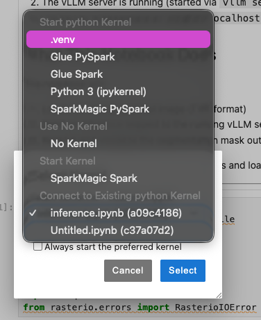

# Geospatial Model Deployment with vLLM

This is one session of the NASA workshop. It walks through serving TerraTorch / Prithvi geospatial foundation models with vLLM, end to end: from raw training artifacts on disk to a running server you can benchmark. 

## Session Structure

Three steps.

### [Step 1: Run a Model in vLLM](./1_run_model_in_vllm/README.md)

Take a TerraTorch model, make it loadable by vLLM, and serve it:
- Convert a TerraTorch YAML configuration into a vLLM-compatible `config.json`
- Convert a PyTorch Lightning checkpoint (`.ckpt`) into a standard PyTorch binary (`.bin`)
- Start a vLLM server with the Prithvi flood-segmentation model and run inference from a notebook

You come out the other side with a `config.json`, a `.bin` weights file, and a running vLLM server returning segmentation masks.

### [Step 2: Benchmarking the vLLM Server](./2_vllm_benchmarking/README.md)

Now that there's a server, push some load at it. Two tools, two different questions:
- `vllm bench` — vLLM's built-in client. Good for "what's the latency at *this* rate?"
- `guidellm` — sweeps across request rates to find where the server starts to fall over
- A notebook reads the resulting `results.json` and pulls out the practical capacity of the deployment

The point is to learn the difference between a spot-check benchmark and a capacity curve, and how to read the latency knee that marks server saturation.

### [Step 3: Custom IOProcessor](./3_terratorch-flip-processor/README.md)

vLLM speaks tensors-in / tensors-out. Real geospatial users send GeoTIFFs and expect GeoTIFFs back. The IOProcessor is the adapter that sits between the two. This step walks through a small custom processor that flips the input and lets the output come back flipped, so you can visually confirm the plugin ran:
- How a custom IOProcessor is structured
- How to register it with vLLM via Python entry points
- How to thread per-request state through the parent's pipeline without re-implementing it

You come out with an installable `terratorch-flip-processor` package, auto-registered with vLLM.

## Prerequisites

- Linux system with NVIDIA GPU
- Python 3.12
- CUDA and NVIDIA drivers installed
- `uv` package manager ([installation guide](https://github.com/astral-sh/uv))

> If you are joining the live session, a pre-configured sandbox is provided — you do not need to install anything locally.

## Setup

Create a virtual environment with `uv` and install the dependencies:

```bash
uv venv
source .venv/bin/activate
uv pip install -r requirements.txt
```

Register the environment as a Jupyter kernel so the notebooks can pick it up:

```bash
python3 -m ipykernel install --user --name=.venv
```

### Selecting the kernel in a notebook

Open one of the notebooks and look at the top-right of the toolbar. The current kernel is shown next to a small circle:


Click it to open the kernel picker, then choose `.venv` from the list:



Once selected, the notebook will run against the environment you just set up.

## Getting Started

Work through the directories in order. Each has its own README with the commands and context for that step.

1. [`1_run_model_in_vllm/`](./1_run_model_in_vllm/README.md) — prepare the model artifacts and serve them with vLLM
2. [`2_vllm_benchmarking/`](./2_vllm_benchmarking/README.md) — benchmark the running server with `vllm bench` and `guidellm`
3. [`3_terratorch-flip-processor/`](./3_terratorch-flip-processor/README.md) — build and install the custom IOProcessor
